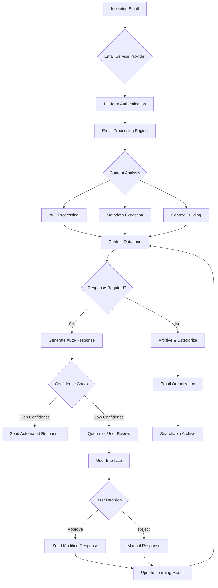
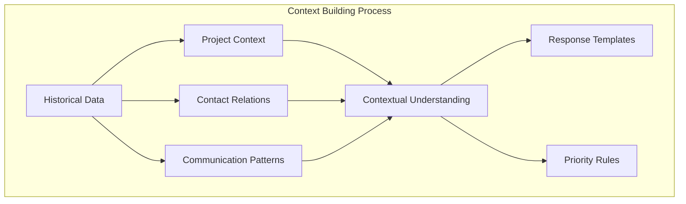
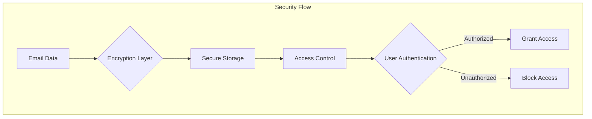
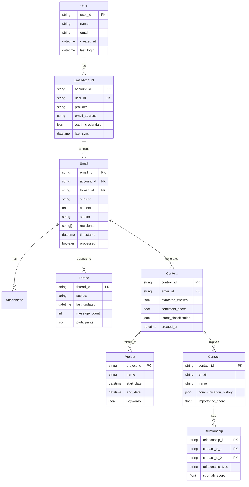
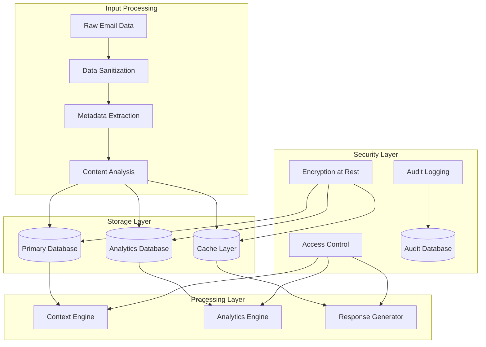

# Product Requirements Document (PRD)

# 1. INTRODUCTION

## 1.1 Purpose
This Product Requirements Document (PRD) outlines the comprehensive requirements for developing an AI-powered email management platform. The document serves as a reference for stakeholders including developers, project managers, QA engineers, and business analysts involved in the development process. It provides detailed specifications, functional requirements, and technical constraints necessary for successful implementation.

## 1.2 Scope
The email management platform aims to revolutionize how professionals handle their work email communications through intelligent tracking and automated responses. The system will:

- Track and analyze incoming/outgoing work emails
- Build contextual understanding of ongoing projects and communications
- Generate appropriate automated responses based on historical context
- Maintain conversation history and relationship mapping
- Provide intelligent email organization and categorization
- Ensure secure handling of sensitive email data
- Integrate with common email service providers

Key benefits include:
- Reduced response time for routine inquiries
- Improved email organization and searchability
- Enhanced productivity through automated response handling
- Better context retention across long-term communications
- Decreased cognitive load in managing multiple email threads

The platform will focus specifically on professional/work email management and will not handle personal email accounts or non-email communications.

# 2. PRODUCT DESCRIPTION

## 2.1 Product Perspective
The AI-powered email management platform operates as a middleware solution that integrates with existing email service providers (ESP) through their APIs. The system sits between users' email clients and ESP servers, processing incoming and outgoing messages while maintaining secure access to email data. The platform functions within the following context:

- Interfaces with major email providers (Gmail, Outlook, etc.)
- Operates alongside existing email clients without replacing them
- Maintains separate secure storage for analysis data and response templates
- Integrates with calendar systems for scheduling context
- Functions within corporate firewall and security requirements

## 2.2 Product Functions
The core functions of the platform include:

1. Email Analysis and Tracking
   - Real-time monitoring of incoming/outgoing emails
   - Natural language processing of email content
   - Metadata extraction and classification
   - Thread and conversation tracking

2. Context Building
   - Project and topic identification
   - Relationship mapping between contacts
   - Historical communication pattern analysis
   - Priority and urgency detection

3. Automated Response Generation
   - Context-aware response drafting
   - Template management and customization
   - Response approval workflow
   - Learning from sent/edited responses

4. Organization and Search
   - Intelligent folder/label management
   - Advanced search capabilities
   - Priority inbox management
   - Archive and retention management

## 2.3 User Characteristics
Primary user personas include:

1. Business Professionals
   - High email volume (50+ per day)
   - Multiple ongoing projects/conversations
   - Limited time for email management
   - Basic to intermediate technical skills

2. Executive Assistants
   - Managing multiple inboxes
   - Complex scheduling requirements
   - High-priority communication handling
   - Advanced email management experience

3. Team Leaders
   - Project-related communications
   - Team coordination via email
   - Delegation and follow-up tracking
   - Intermediate to advanced technical skills

## 2.4 Constraints
1. Technical Constraints
   - Email service provider API limitations
   - Response time requirements (<2 seconds)
   - Data storage and processing regulations
   - Email server compatibility requirements

2. Security Constraints
   - Data encryption requirements
   - Authentication protocols
   - Privacy regulations compliance
   - Corporate security policies

3. Business Constraints
   - Integration with existing workflow systems
   - User training requirements
   - Scalability limitations
   - Maintenance windows

## 2.5 Assumptions and Dependencies
Assumptions:
- Users have stable internet connectivity
- Email services remain accessible via API
- Users maintain consistent email patterns
- Corporate policies allow AI email processing

Dependencies:
- Email service provider API availability
- Natural Language Processing services
- Cloud infrastructure services
- Authentication services
- Data storage systems
- Security certificate authorities

# 3. PROCESS FLOWCHART







# 4. FUNCTIONAL REQUIREMENTS

## 4.1 Email Integration and Monitoring

### ID: F001
### Description
Core email service integration and real-time monitoring capabilities
### Priority
High
### Requirements

| ID | Requirement | Priority |
|---|---|---|
| F001.1 | Support OAuth2 authentication for Gmail and Outlook | Must Have |
| F001.2 | Real-time monitoring of incoming emails via IMAP/API | Must Have |
| F001.3 | Email metadata extraction (sender, timestamp, subject, attachments) | Must Have |
| F001.4 | Email thread tracking and relationship mapping | Must Have |
| F001.5 | Support for multiple email accounts per user | Should Have |
| F001.6 | Email service provider status monitoring | Should Have |

## 4.2 Context Analysis Engine

### ID: F002
### Description
AI-powered analysis system for building and maintaining communication context
### Priority
High
### Requirements

| ID | Requirement | Priority |
|---|---|---|
| F002.1 | Natural Language Processing of email content | Must Have |
| F002.2 | Project and topic identification from email content | Must Have |
| F002.3 | Contact relationship mapping and importance scoring | Must Have |
| F002.4 | Historical communication pattern analysis | Must Have |
| F002.5 | Sentiment analysis of email conversations | Should Have |
| F002.6 | Automated tagging and categorization of emails | Must Have |

## 4.3 Automated Response System

### ID: F003
### Description
Intelligent response generation and management system
### Priority
High
### Requirements

| ID | Requirement | Priority |
|---|---|---|
| F003.1 | Context-aware response template generation | Must Have |
| F003.2 | Response confidence scoring | Must Have |
| F003.3 | User review interface for low-confidence responses | Must Have |
| F003.4 | Learning from user edits and corrections | Must Have |
| F003.5 | Custom response template management | Should Have |
| F003.6 | Multi-language response support | Could Have |

## 4.4 Email Organization

### ID: F004
### Description
Intelligent email organization and search capabilities
### Priority
Medium
### Requirements

| ID | Requirement | Priority |
|---|---|---|
| F004.1 | Automated folder/label creation and management | Must Have |
| F004.2 | Priority inbox sorting based on context | Must Have |
| F004.3 | Advanced search with context-aware filters | Must Have |
| F004.4 | Email archiving with retention policies | Should Have |
| F004.5 | Custom organization rules creation | Should Have |
| F004.6 | Bulk email management actions | Could Have |

## 4.5 Security and Privacy

### ID: F005
### Description
Security features and privacy protection mechanisms
### Priority
High
### Requirements

| ID | Requirement | Priority |
|---|---|---|
| F005.1 | End-to-end encryption of email data | Must Have |
| F005.2 | Secure storage of context and analysis data | Must Have |
| F005.3 | Role-based access control | Must Have |
| F005.4 | Audit logging of all system actions | Must Have |
| F005.5 | Data retention and deletion controls | Must Have |
| F005.6 | Privacy policy compliance tools | Must Have |

## 4.6 User Interface

### ID: F006
### Description
Web-based interface for system interaction and management
### Priority
Medium
### Requirements

| ID | Requirement | Priority |
|---|---|---|
| F006.1 | Dashboard for email analytics and insights | Must Have |
| F006.2 | Response review and editing interface | Must Have |
| F006.3 | Context visualization tools | Should Have |
| F006.4 | System configuration and settings management | Must Have |
| F006.5 | Mobile-responsive design | Should Have |
| F006.6 | Activity and performance reporting | Could Have |

# 5. NON-FUNCTIONAL REQUIREMENTS

## 5.1 Performance Requirements

| ID | Requirement | Target Metric |
|---|---|---|
| P001 | Email processing latency | < 2 seconds per email |
| P002 | Response generation time | < 3 seconds per response |
| P003 | Search query response time | < 1 second |
| P004 | Maximum concurrent users | 10,000 users |
| P005 | API request handling | 100 requests/second |
| P006 | Storage throughput | 1000 IOPS |
| P007 | Maximum memory usage | 2GB per user session |
| P008 | Database query response time | < 100ms |

## 5.2 Safety Requirements

| ID | Requirement | Description |
|---|---|---|
| S001 | Data Backup | Automated hourly backups with 30-day retention |
| S002 | Failover System | Hot standby with automatic failover < 1 minute |
| S003 | Data Recovery | Recovery Point Objective (RPO) of 1 hour |
| S004 | System Recovery | Recovery Time Objective (RTO) of 4 hours |
| S005 | Error Handling | Graceful degradation of non-critical functions |
| S006 | Data Corruption Prevention | Checksums and validation for all stored data |

## 5.3 Security Requirements

| ID | Requirement | Description |
|---|---|---|
| SE001 | Authentication | Multi-factor authentication support |
| SE002 | Data Encryption | AES-256 encryption for data at rest |
| SE003 | Transport Security | TLS 1.3 for all data in transit |
| SE004 | Access Control | Role-based access control (RBAC) |
| SE005 | Audit Logging | Comprehensive logging of all security events |
| SE006 | Session Management | Automatic session timeout after 30 minutes |
| SE007 | Password Policy | Complex passwords with 90-day rotation |
| SE008 | API Security | OAuth 2.0 and API key authentication |

## 5.4 Quality Requirements

### 5.4.1 Availability
- System uptime: 99.9% (excluding planned maintenance)
- Planned maintenance window: Maximum 4 hours monthly
- Service degradation: < 0.1% of total operation time

### 5.4.2 Maintainability
- Code documentation coverage: Minimum 80%
- Modular architecture with loose coupling
- Automated deployment pipeline
- Maximum 24-hour resolution for critical issues

### 5.4.3 Usability
- Maximum 2-hour learning curve for basic functions
- Accessibility compliance with WCAG 2.1 Level AA
- Support for multiple languages and locales
- Mobile responsiveness across all features

### 5.4.4 Scalability
- Horizontal scaling capability up to 100,000 users
- Auto-scaling based on load metrics
- Database partitioning support
- Microservices architecture for independent scaling

### 5.4.5 Reliability
- Mean Time Between Failures (MTBF): > 720 hours
- Mean Time To Recovery (MTTR): < 1 hour
- Error rate: < 0.1% of all transactions
- Data durability: 99.999999999%

## 5.5 Compliance Requirements

| ID | Requirement | Description |
|---|---|---|
| C001 | GDPR Compliance | Full compliance with EU data protection regulations |
| C002 | CCPA Compliance | California Consumer Privacy Act requirements |
| C003 | SOC 2 Type II | Annual audit and certification |
| C004 | ISO 27001 | Information security management standards |
| C005 | HIPAA Compliance | Health information privacy standards |
| C006 | Data Residency | Regional data storage requirements |
| C007 | Email Standards | RFC 5322 and MIME standards compliance |
| C008 | Accessibility | Section 508 compliance |

# 6. DATA REQUIREMENTS

## 6.1 Data Models



## 6.2 Data Storage

### 6.2.1 Primary Storage
- PostgreSQL for structured data (user accounts, email metadata, relationships)
- MongoDB for unstructured data (email content, context analysis)
- Redis for caching and session management
- MinIO for attachment storage

### 6.2.2 Data Retention
- Email data: 7 years with tiered storage
- Context analysis: 3 years
- User activity logs: 2 years
- System logs: 1 year
- Temporary cache: 24 hours

### 6.2.3 Backup and Recovery
- Hourly incremental backups
- Daily full backups
- Weekly consolidated backups
- Geographic replication across 3 regions
- Point-in-time recovery capability up to 30 days
- 99.999999999% durability guarantee

## 6.3 Data Processing



### 6.3.1 Data Security
- AES-256 encryption for data at rest
- TLS 1.3 for data in transit
- Field-level encryption for sensitive data
- Key rotation every 90 days
- Secure key management using AWS KMS
- Data masking for non-production environments

### 6.3.2 Data Processing Requirements
- Real-time processing for incoming emails
- Batch processing for historical analysis
- Stream processing for context updates
- Maximum processing latency: 2 seconds
- Concurrent processing capacity: 1000 emails/second
- Error handling with dead letter queues
- Automatic retry mechanism for failed processing

### 6.3.3 Data Quality Requirements
- Email format validation
- Duplicate detection and handling
- Data completeness checks
- Consistency validation
- Regular data integrity audits
- Automated data cleanup processes

# 7. EXTERNAL INTERFACES

## 7.1 User Interfaces

### 7.1.1 Web Application Interface
- Responsive web interface supporting desktop and mobile browsers
- Minimum supported resolutions: 1920x1080 (desktop), 375x667 (mobile)
- Material Design 3.0 components for consistent UI elements
- Dark/light theme support with system preference detection
- Keyboard shortcuts for common actions
- Screen reader compatibility

### 7.1.2 Key Interface Components

| Component | Description | Priority |
|-----------|-------------|----------|
| Email Dashboard | Real-time view of incoming/outgoing emails with context | Must Have |
| Response Review Panel | Interface for reviewing and editing auto-generated responses | Must Have |
| Context Explorer | Visual representation of email relationships and projects | Should Have |
| Settings Console | Configuration interface for system preferences | Must Have |
| Analytics View | Visualization of email patterns and response metrics | Should Have |

## 7.2 Hardware Interfaces

### 7.2.1 Storage Systems
- SSD storage interface for high-performance data access
- Minimum 10Gbps network interface for data transfer
- RAID controller interface for redundant storage
- Hardware encryption module interface for secure data storage

### 7.2.2 Network Hardware
- Network Interface Cards (NICs) supporting IPv4/IPv6
- Load balancer interface requirements
- Firewall hardware integration points
- VPN hardware compatibility requirements

## 7.3 Software Interfaces

### 7.3.1 Email Service Provider APIs

| Provider | API Version | Authentication | Rate Limits |
|----------|-------------|----------------|-------------|
| Gmail | Google API v1 | OAuth 2.0 | 250 requests/second |
| Outlook | Microsoft Graph v1.0 | OAuth 2.0 | 200 requests/second |
| Exchange | EWS API 2016 | OAuth 2.0 | 100 requests/second |
| IMAP | RFC 3501 | SASL | Provider-dependent |

### 7.3.2 External Services

| Service | Purpose | Interface Type |
|---------|----------|---------------|
| AWS S3 | Attachment Storage | REST API |
| Redis | Caching Layer | Redis Protocol |
| PostgreSQL | Primary Database | PostgreSQL Wire Protocol |
| MongoDB | Context Storage | MongoDB Wire Protocol |
| Elasticsearch | Search Engine | REST API |

## 7.4 Communication Interfaces

### 7.4.1 Network Protocols
- HTTPS (TLS 1.3) for web interface
- WebSocket for real-time updates
- SMTP/IMAP/POP3 for email communication
- gRPC for internal service communication

### 7.4.2 Data Formats

| Format | Usage | Specification |
|--------|-------|---------------|
| JSON | API responses | RFC 8259 |
| Protocol Buffers | Internal communication | Proto3 |
| MIME | Email content | RFC 2045-2049 |
| JWT | Authentication tokens | RFC 7519 |

### 7.4.3 API Specifications

```yaml
openapi: 3.0.0
paths:
  /api/v1/emails:
    get:
      description: Retrieve emails with context
      parameters:
        - name: limit
          in: query
          type: integer
        - name: offset
          in: query
          type: integer
      responses:
        '200':
          description: Success
          content:
            application/json:
              schema:
                type: array
                items:
                  $ref: '#/components/schemas/Email'
```

# 8. APPENDICES

## 8.1 GLOSSARY

| Term | Definition |
|------|------------|
| Context Building | The process of analyzing email content and metadata to understand relationships, projects, and communication patterns |
| Dead Letter Queue | A storage mechanism for messages that cannot be delivered or processed successfully |
| Field-level Encryption | Encryption of specific data fields rather than entire documents or databases |
| Hot Standby | A failover configuration where the backup system runs simultaneously with the primary system |
| Response Template | Pre-defined email response structure that can be customized based on context |
| Thread | A series of related email messages under the same subject or conversation |
| Tiered Storage | A data storage architecture that moves data between different types of storage media based on age and access patterns |

## 8.2 ACRONYMS

| Acronym | Definition |
|---------|------------|
| API | Application Programming Interface |
| CCPA | California Consumer Privacy Act |
| ESP | Email Service Provider |
| GDPR | General Data Protection Regulation |
| HIPAA | Health Insurance Portability and Accountability Act |
| IMAP | Internet Message Access Protocol |
| IOPS | Input/Output Operations Per Second |
| JWT | JSON Web Token |
| KMS | Key Management Service |
| MIME | Multipurpose Internet Mail Extensions |
| MTBF | Mean Time Between Failures |
| MTTR | Mean Time To Recovery |
| NIC | Network Interface Card |
| NLP | Natural Language Processing |
| OAuth | Open Authorization |
| RAID | Redundant Array of Independent Disks |
| RBAC | Role-Based Access Control |
| RFC | Request for Comments |
| RPO | Recovery Point Objective |
| RTO | Recovery Time Objective |
| SASL | Simple Authentication and Security Layer |
| SMTP | Simple Mail Transfer Protocol |
| SOC | System and Organization Controls |
| TLS | Transport Layer Security |
| VPN | Virtual Private Network |
| WCAG | Web Content Accessibility Guidelines |

## 8.3 ADDITIONAL REFERENCES

| Reference | Description | URL |
|-----------|-------------|-----|
| Gmail API Documentation | Official documentation for Gmail API integration | https://developers.google.com/gmail/api |
| Microsoft Graph API | Documentation for Outlook/Exchange integration | https://docs.microsoft.com/en-us/graph |
| RFC 5322 | Internet Message Format specification | https://tools.ietf.org/html/rfc5322 |
| GDPR Documentation | Official EU GDPR compliance guidelines | https://gdpr.eu/documentation |
| OAuth 2.0 Specification | Authorization framework specification | https://oauth.net/2 |
| Redis Documentation | Official Redis implementation guide | https://redis.io/documentation |
| PostgreSQL Documentation | PostgreSQL database documentation | https://www.postgresql.org/docs |
| MongoDB Documentation | MongoDB database documentation | https://docs.mongodb.com |
| AWS S3 Documentation | Amazon S3 storage service documentation | https://docs.aws.amazon.com/s3 |
| Material Design Guidelines | UI/UX design specifications | https://material.io/design |