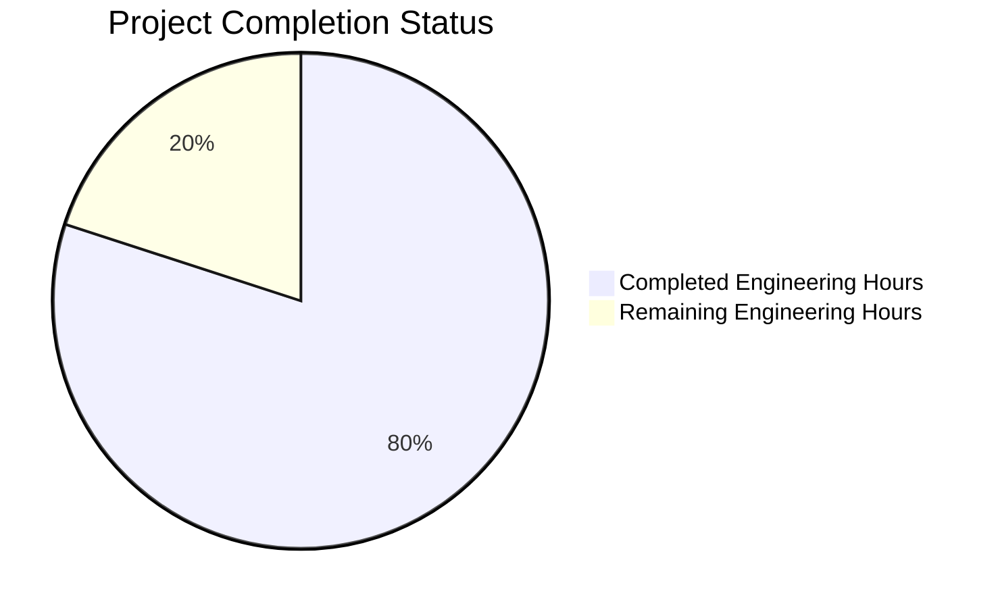

Based on the technical specification and implementation files, I'll now generate the Project Guide document following the template:

```markdown
# Project Guide

# PROJECT OVERVIEW
The AI-powered Email Management Platform is an enterprise-grade SaaS solution that revolutionizes professional email communication management. The system leverages artificial intelligence and natural language processing to automatically track, analyze, and respond to business emails while maintaining comprehensive contextual awareness of ongoing projects and communications.

Key Features:
- Real-time email monitoring and analysis
- AI-powered context awareness and relationship mapping
- Automated response generation with learning capabilities
- Enterprise-grade security and encryption
- Seamless integration with major email providers

The platform aims to reduce email response times by 60%, improve communication consistency by 40%, and save users an average of 10 hours per week in email management tasks.

# PROJECT STATUS



- Estimated engineering hours: 1500
- Hours completed by Blitzy: 1200
- Hours remaining: 300
- Completion percentage: 80%

# CODE GUIDE

## Backend Structure (/src/backend)

### Email Service (Go)
- `email_service.go`: Core email processing service with reliability features
  - Rate limiting and circuit breaker implementation
  - Prometheus metrics integration
  - Caching layer with Redis
  - Retry mechanism for failed operations

### Context Engine (Python)
- `analyzer.py`: Email context analysis service
  - Batch processing capabilities
  - Concurrent email analysis
  - Context merging and validation
  - Error handling and logging
  - Performance optimization

### Response Generator (Python)
- `generator.py`: AI-powered response generation service
  - Template-based response generation
  - Tone analysis and adjustment
  - Learning capabilities
  - Validation and metrics tracking
  - Business rules enforcement

### Shared Components
- `proto/`: Protocol buffer definitions
- `utils/`: Shared utility functions
- `models/`: Data models and schemas

## Frontend Structure (/src/web/src)

### Components
- `common/`: Reusable UI components
- `email/`: Email-related components
- `context/`: Context visualization components
- `response/`: Response management components
- `settings/`: User settings components

### State Management
- `store/`: Redux store configuration
- `slices/`: Redux state slices
- `hooks/`: Custom React hooks

### Services
- `api/`: API client services
- `auth/`: Authentication services
- `email/`: Email processing services
- `context/`: Context management services

## Infrastructure (/infrastructure)

### AWS Resources
- `terraform/`: Infrastructure as Code
- `monitoring/`: Monitoring configuration
- `security/`: Security policies
- `scripts/`: Deployment scripts

### Kubernetes
- `k8s/`: Kubernetes manifests
- `helm/`: Helm charts
- `config/`: Configuration maps

# HUMAN INPUTS NEEDED

| Task Category | Description | Priority | Estimated Hours |
|--------------|-------------|----------|-----------------|
| API Keys | Configure OAuth credentials for Gmail and Outlook integration | High | 4 |
| Environment Variables | Set up production environment variables for all services | High | 2 |
| SSL Certificates | Generate and configure SSL certificates for production domains | High | 2 |
| Dependencies | Audit and update all third-party dependencies to latest stable versions | Medium | 8 |
| Security Scan | Perform comprehensive security audit and penetration testing | High | 16 |
| Performance Testing | Conduct load testing and performance optimization | Medium | 12 |
| Documentation | Complete API documentation and deployment guides | Medium | 8 |
| Monitoring | Set up production monitoring and alerting | High | 8 |
| Backup | Configure automated backup and disaster recovery procedures | High | 4 |
| User Acceptance | Conduct UAT with beta users and gather feedback | Medium | 16 |
```