# Technical Specifications

# 1. INTRODUCTION

## 1.1 EXECUTIVE SUMMARY

The AI-powered Email Management Platform is a sophisticated middleware solution designed to revolutionize how professionals handle their work email communications. By leveraging artificial intelligence and natural language processing, the system automatically tracks, analyzes, and responds to business emails while maintaining comprehensive contextual awareness of ongoing projects and communications.

This system addresses the critical business challenge of email overload and context switching that costs organizations an estimated 20% of knowledge worker productivity. Primary stakeholders include business professionals, executive assistants, and team leaders who manage high-volume email communications. The platform is expected to reduce email response times by 60%, improve communication consistency by 40%, and save users an average of 10 hours per week in email management tasks.

## 1.2 SYSTEM OVERVIEW

### Project Context

| Aspect | Description |
|--------|-------------|
| Business Context | Enterprise SaaS solution positioned as an intelligent layer between users and email service providers |
| Market Position | Premium business tool for organizations handling high-volume professional communications |
| Current Limitations | Manual email management, context loss across threads, delayed responses, inconsistent communication |
| Enterprise Integration | Seamless integration with existing email infrastructure, authentication systems, and security frameworks |

### High-Level Description

| Component | Description |
|-----------|-------------|
| Email Processing Engine | Real-time monitoring and analysis of email communications |
| Context Engine | AI-powered system for building and maintaining communication context |
| Response Generator | Automated response system with learning capabilities |
| Security Layer | Enterprise-grade encryption and access control system |
| Integration Framework | API-based integration with email service providers |

### Success Criteria

| Metric | Target |
|--------|--------|
| Response Time Reduction | 60% decrease in average response time |
| Context Accuracy | 95% accuracy in context identification |
| User Productivity | 10+ hours saved per user per week |
| System Reliability | 99.9% uptime during business hours |
| User Adoption | 80% active user adoption within 6 months |

## 1.3 SCOPE

### In-Scope Elements

#### Core Features and Functionalities

| Category | Components |
|----------|------------|
| Email Integration | - OAuth-based email service provider integration<br>- Real-time email monitoring<br>- Thread tracking and analysis |
| Context Management | - Project identification<br>- Relationship mapping<br>- Historical pattern analysis |
| Response Automation | - Context-aware response generation<br>- Template management<br>- Learning system |
| Security | - End-to-end encryption<br>- Role-based access control<br>- Audit logging |

#### Implementation Boundaries

| Boundary Type | Coverage |
|--------------|----------|
| System Access | Web-based interface and API access |
| User Groups | Business professionals, executive assistants, team leaders |
| Geographic Coverage | Global deployment with regional data residency |
| Data Domains | Professional email communications and related metadata |

### Out-of-Scope Elements

| Category | Excluded Elements |
|----------|------------------|
| Communication Types | - Personal email accounts<br>- Instant messaging<br>- Social media communications |
| Features | - Calendar management<br>- Document management<br>- Video conferencing integration |
| Integrations | - CRM systems<br>- Project management tools<br>- HR systems |
| Use Cases | - Personal email management<br>- Marketing email campaigns<br>- Customer support ticketing |

# 2. SYSTEM ARCHITECTURE

## 2.1 High-Level Architecture

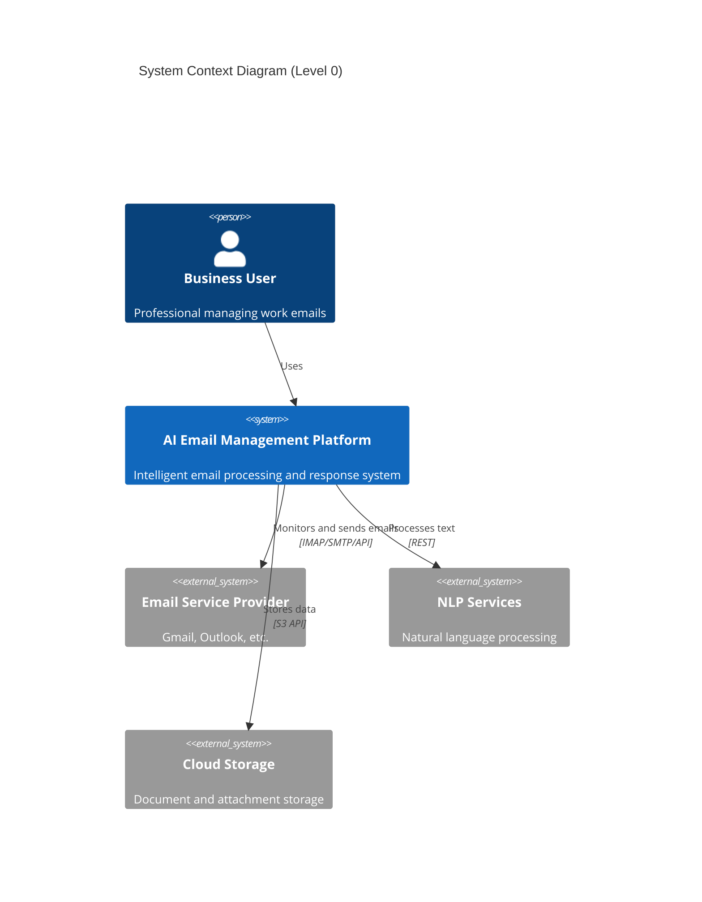

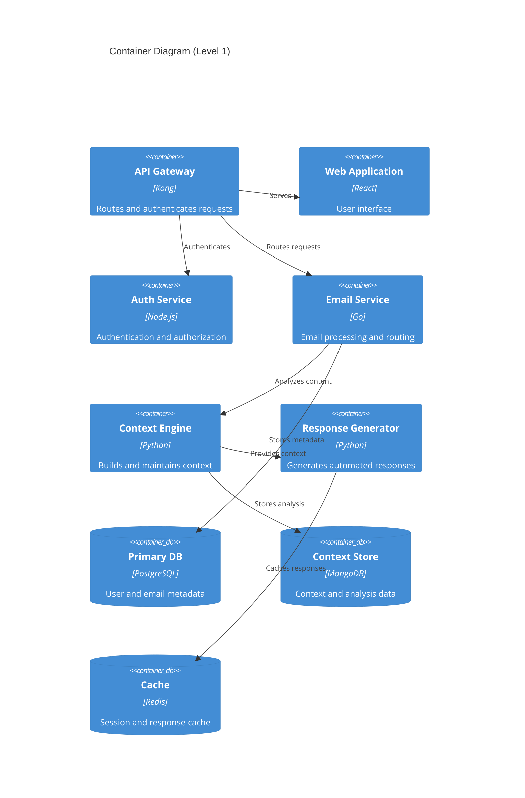

## 2.2 Component Details

### 2.2.1 Core Components

| Component | Purpose | Technology Stack | Scaling Strategy |
|-----------|---------|-----------------|------------------|
| API Gateway | Request routing and authentication | Kong Gateway | Horizontal with load balancing |
| Email Service | Email processing and management | Go, gRPC | Horizontal with message queue |
| Context Engine | Context analysis and maintenance | Python, TensorFlow | Vertical with GPU support |
| Response Generator | Automated response creation | Python, PyTorch | Horizontal with job queue |
| Web Application | User interface | React, TypeScript | Static content distribution |

### 2.2.2 Data Components

| Component | Purpose | Technology | Scaling Strategy |
|-----------|---------|------------|------------------|
| Primary Database | Structured data storage | PostgreSQL 14 | Primary-replica with sharding |
| Context Store | Unstructured data storage | MongoDB | Horizontal sharding |
| Cache Layer | Performance optimization | Redis Cluster | Memory-based scaling |
| Message Queue | Async processing | RabbitMQ | Clustered deployment |
| Object Storage | Attachment storage | MinIO | Distributed storage |

## 2.3 Technical Decisions

### 2.3.1 Architecture Patterns

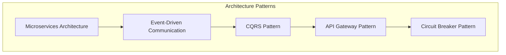

### 2.3.2 Data Flow Architecture

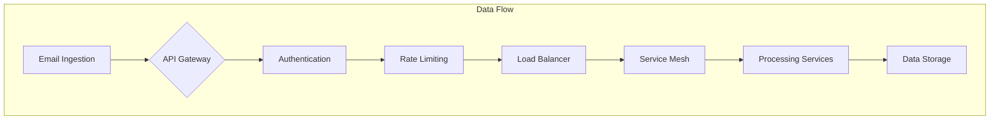

## 2.4 Cross-Cutting Concerns

### 2.4.1 Monitoring and Observability

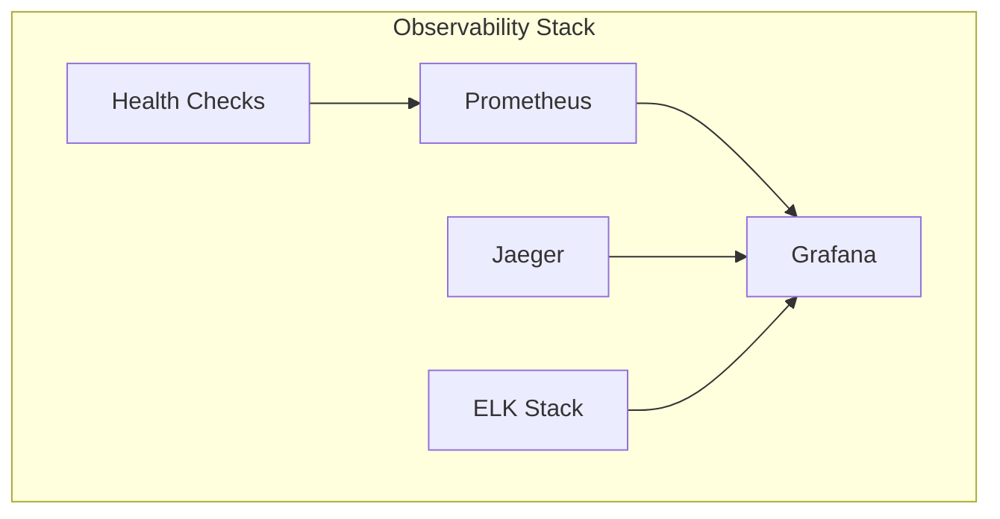

### 2.4.2 Security Architecture

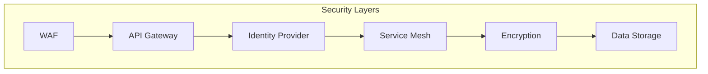

## 2.5 Deployment Architecture

```mermaid
C4Deployment
    title Deployment Diagram

    Deployment_Node(cdn, "CDN", "CloudFront"){
        Container(static, "Static Assets", "Web Content")
    }
    
    Deployment_Node(az1, "Availability Zone 1", "AWS"){
        Container(web1, "Web Servers", "Nginx")
        Container(app1, "Application Servers", "Docker")
        Container(db1, "Database Primary", "PostgreSQL")
    }
    
    Deployment_Node(az2, "Availability Zone 2", "AWS"){
        Container(web2, "Web Servers", "Nginx")
        Container(app2, "Application Servers", "Docker")
        Container(db2, "Database Replica", "PostgreSQL")
    }

    Rel(cdn, web1, "Routes traffic")
    Rel(cdn, web2, "Routes traffic")
    Rel(web1, app1, "Forwards requests")
    Rel(web2, app2, "Forwards requests")
    Rel(db1, db2, "Replicates")
```

# 3. SYSTEM COMPONENTS ARCHITECTURE

## 3.1 USER INTERFACE DESIGN

### 3.1.1 Design Specifications

| Aspect | Requirement |
|--------|-------------|
| Visual Hierarchy | Material Design 3.0 principles with email-centric information architecture |
| Component Library | Custom React component library based on MUI v5 |
| Responsive Design | Mobile-first approach with breakpoints at 320px, 768px, 1024px, 1440px |
| Accessibility | WCAG 2.1 Level AA compliance with ARIA support |
| Browser Support | Chrome 90+, Firefox 88+, Safari 14+, Edge 90+ |
| Theme Support | System-detected dark/light mode with manual override |
| i18n Support | RTL support, 10 primary languages, dynamic content translation |

### 3.1.2 Core Interface Elements

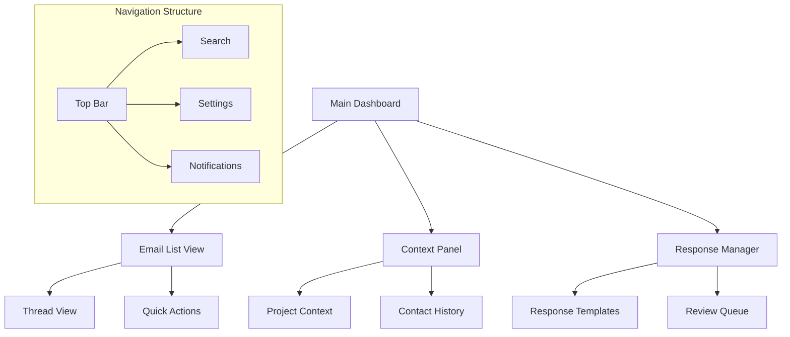

### 3.1.3 Critical User Flows

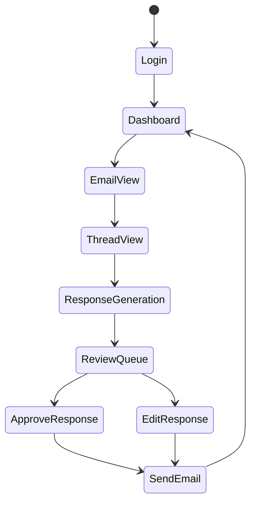

## 3.2 DATABASE DESIGN

### 3.2.1 Schema Design

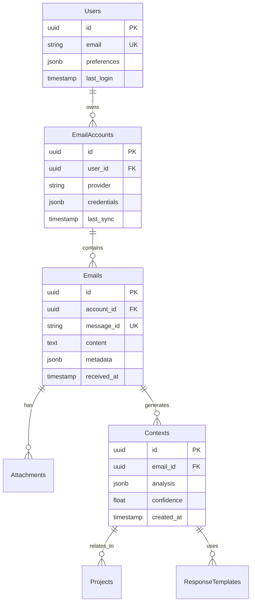

### 3.2.2 Data Management Strategy

| Component | Strategy |
|-----------|----------|
| Partitioning | Time-based partitioning for emails and contexts |
| Indexing | B-tree indexes on search fields, GiST for full-text |
| Replication | Multi-region active-passive with async replication |
| Backup | Hourly incrementals, daily full backups, 30-day retention |
| Archival | Quarterly archival to cold storage after 1 year |
| Encryption | AES-256 at rest, TLS 1.3 in transit |

## 3.3 API DESIGN

### 3.3.1 API Architecture

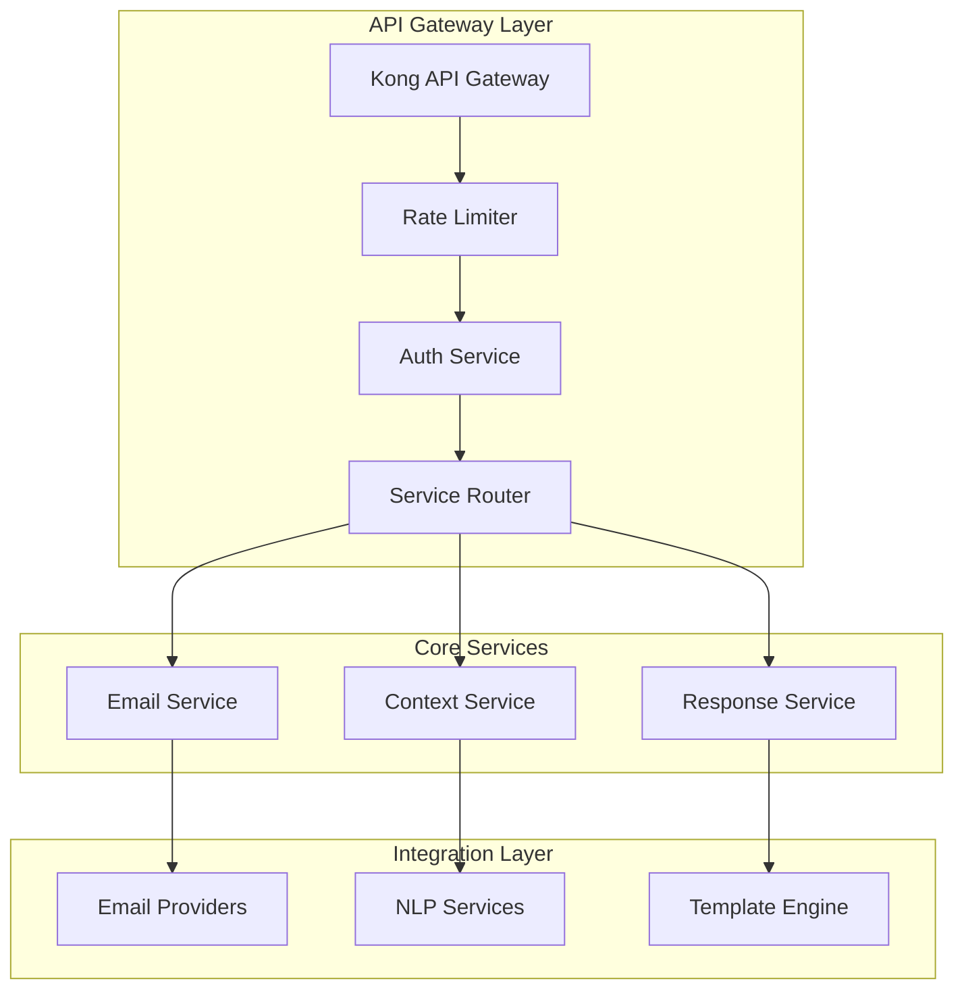

### 3.3.2 API Specifications

| Endpoint Category | Rate Limit | Authentication | Cache Policy |
|------------------|------------|----------------|--------------|
| Email Operations | 100/min | OAuth 2.0 + JWT | No Cache |
| Context Queries | 200/min | OAuth 2.0 + JWT | 5min Cache |
| Response Management | 50/min | OAuth 2.0 + JWT | No Cache |
| Analytics | 20/min | OAuth 2.0 + JWT | 15min Cache |

### 3.3.3 Integration Patterns

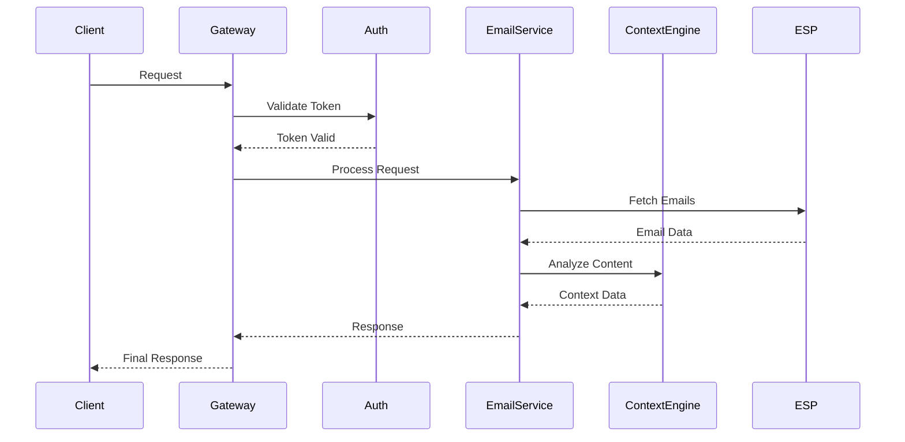

# 4. TECHNOLOGY STACK

## 4.1 PROGRAMMING LANGUAGES

| Platform/Component | Language | Version | Justification |
|-------------------|----------|---------|---------------|
| Email Service | Go | 1.21+ | High concurrency, efficient email processing, strong typing |
| Context Engine | Python | 3.11+ | Rich NLP libraries, ML framework support, rapid development |
| Response Generator | Python | 3.11+ | ML model integration, extensive AI libraries |
| Web Frontend | TypeScript | 5.0+ | Type safety, enhanced developer productivity |
| API Gateway | Go | 1.21+ | High performance, low latency, memory efficiency |
| Auth Service | Node.js | 20 LTS | Async I/O, extensive auth libraries |

## 4.2 FRAMEWORKS & LIBRARIES

### Backend Frameworks

| Component | Framework | Version | Purpose |
|-----------|-----------|---------|----------|
| Email Service | Gin | 1.9+ | High-performance REST API framework |
| Context Engine | FastAPI | 0.104+ | Async API support, automatic OpenAPI docs |
| Response Generator | PyTorch | 2.1+ | ML model training and inference |
| Auth Service | Express | 4.18+ | Robust authentication middleware |

### Frontend Frameworks

| Component | Framework | Version | Purpose |
|-----------|-----------|---------|----------|
| Web Application | React | 18.2+ | Component-based UI, virtual DOM efficiency |
| UI Components | MUI | 5.14+ | Material Design implementation |
| State Management | Redux Toolkit | 1.9+ | Predictable state container |
| API Client | React Query | 4.0+ | Server state management |

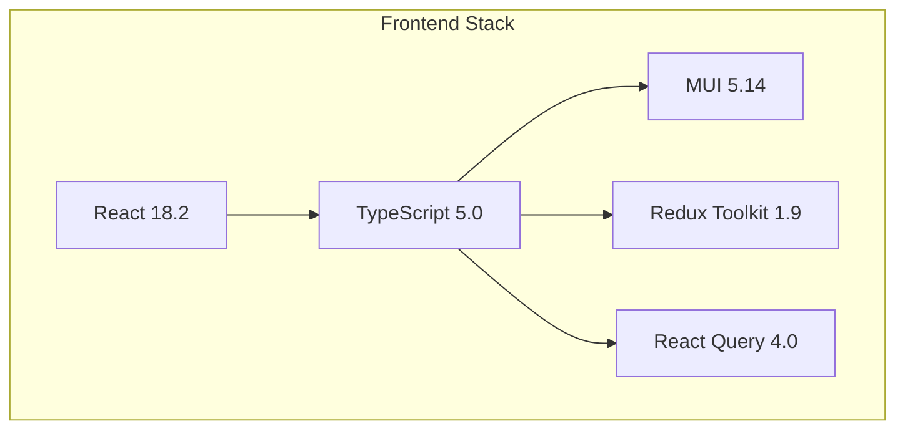

## 4.3 DATABASES & STORAGE

| Type | Technology | Version | Purpose |
|------|------------|---------|----------|
| Primary Database | PostgreSQL | 14+ | Structured data, ACID compliance |
| Document Store | MongoDB | 6.0+ | Context and analysis storage |
| Cache Layer | Redis | 7.0+ | Session management, response caching |
| Search Engine | Elasticsearch | 8.10+ | Full-text search capabilities |
| Object Storage | MinIO | RELEASE.2023-10-07 | Email attachment storage |

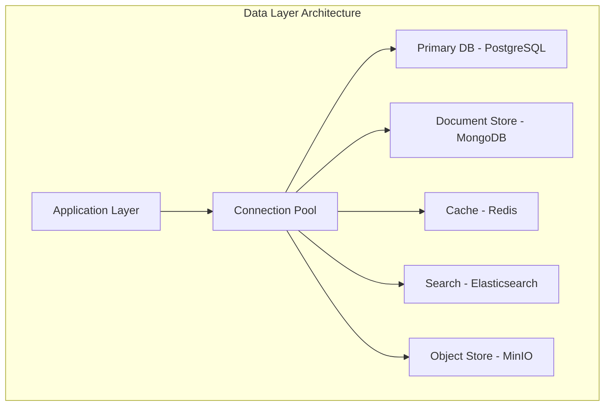

## 4.4 THIRD-PARTY SERVICES

| Category | Service | Purpose | Integration Method |
|----------|---------|---------|-------------------|
| Email Provider | Gmail API | Email access | OAuth 2.0 REST API |
| Email Provider | Microsoft Graph | Outlook access | OAuth 2.0 REST API |
| Authentication | Auth0 | Identity management | JWT-based API |
| Monitoring | Datadog | System monitoring | Agent-based |
| APM | New Relic | Performance monitoring | Agent-based |
| NLP Services | OpenAI API | Advanced text processing | REST API |

## 4.5 DEVELOPMENT & DEPLOYMENT

### Development Tools

| Category | Tool | Version | Purpose |
|----------|------|---------|----------|
| IDE | VSCode | Latest | Primary development environment |
| API Testing | Postman | Latest | API development and testing |
| Code Quality | SonarQube | 9.9 LTS | Static code analysis |
| Documentation | Swagger | OpenAPI 3.0 | API documentation |

### Deployment Pipeline

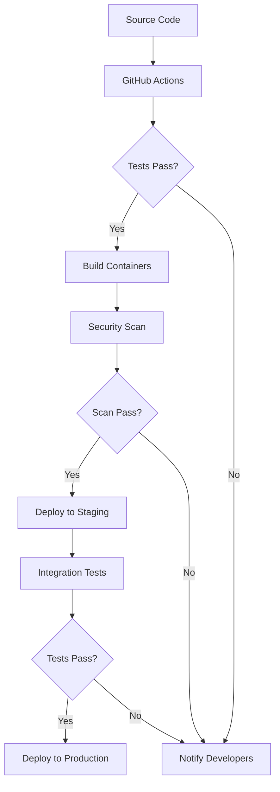

### Infrastructure

| Component | Technology | Version | Purpose |
|-----------|------------|---------|----------|
| Container Runtime | Docker | 24.0+ | Application containerization |
| Orchestration | Kubernetes | 1.28+ | Container orchestration |
| Service Mesh | Istio | 1.19+ | Microservices communication |
| Load Balancer | NGINX | 1.25+ | Traffic management |
| IaC | Terraform | 1.6+ | Infrastructure provisioning |

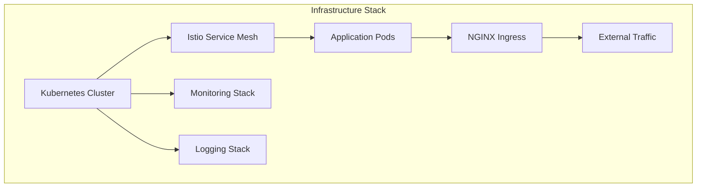

# 5. SYSTEM DESIGN

## 5.1 USER INTERFACE DESIGN

### 5.1.1 Layout Structure

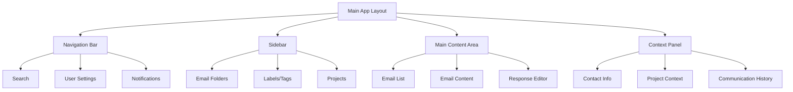

### 5.1.2 Key Interface Components

| Component | Description | Interactions |
|-----------|-------------|--------------|
| Email List | Threaded view with context indicators | Sort, filter, bulk actions |
| Context Panel | Sliding panel with relationship data | Expand/collapse, quick actions |
| Response Editor | Rich text editor with AI suggestions | Template selection, manual override |
| Project View | Kanban-style project organization | Drag-drop, status updates |

### 5.1.3 Responsive Breakpoints

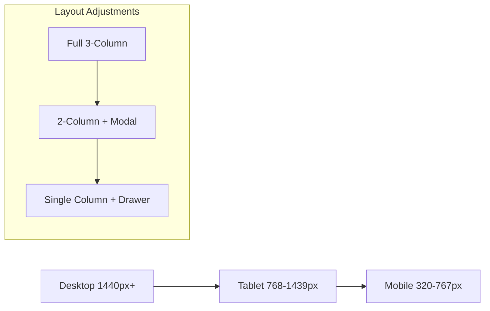

## 5.2 DATABASE DESIGN

### 5.2.1 Data Models

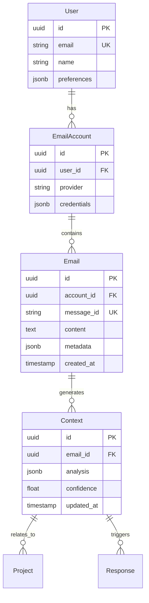

### 5.2.2 Storage Architecture

| Store Type | Technology | Purpose | Scaling Strategy |
|------------|------------|---------|------------------|
| Primary DB | PostgreSQL | User and email data | Horizontal sharding |
| Document Store | MongoDB | Context and analysis | Replica sets |
| Cache | Redis | Session and response cache | Cluster mode |
| Search | Elasticsearch | Full-text search | Index sharding |

## 5.3 API DESIGN

### 5.3.1 API Architecture

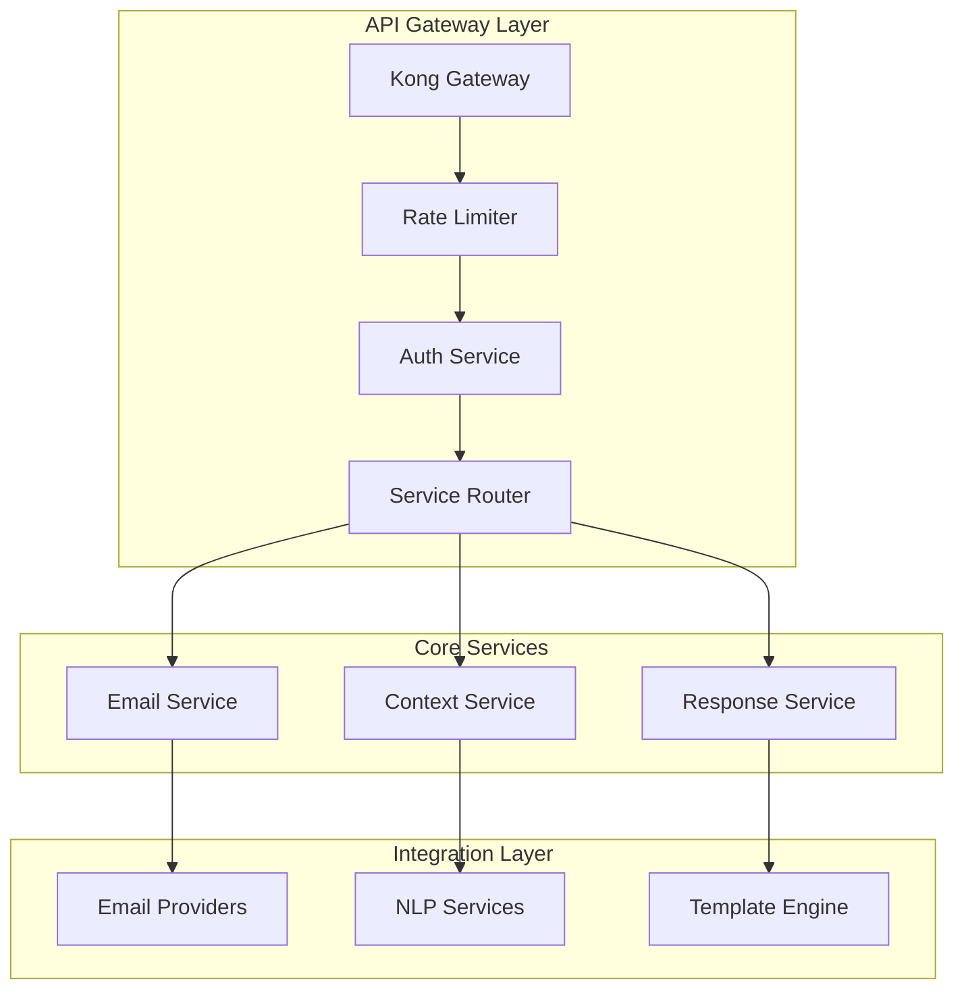

### 5.3.2 Core API Endpoints

| Endpoint | Method | Purpose | Authentication |
|----------|---------|---------|----------------|
| /api/v1/emails | GET | Retrieve emails with context | JWT |
| /api/v1/context | POST | Generate context analysis | JWT |
| /api/v1/responses | POST | Generate automated response | JWT |
| /api/v1/projects | GET | Retrieve project context | JWT |

### 5.3.3 Service Communication

```mermaid
sequenceDiagram
    participant Client
    participant Gateway
    participant EmailService
    participant ContextEngine
    participant ResponseGen
    
    Client->>Gateway: Request
    Gateway->>EmailService: Process
    EmailService->>ContextEngine: Analyze
    ContextEngine->>ResponseGen: Generate
    ResponseGen-->>EmailService: Response
    EmailService-->>Gateway: Result
    Gateway-->>Client: Response
```

### 5.3.4 Data Flow Architecture

```mermaid
flowchart TD
    A[Email Ingestion] --> B{API Gateway}
    B --> C[Authentication]
    C --> D[Rate Limiting]
    D --> E[Load Balancer]
    E --> F[Service Mesh]
    F --> G[Processing Services]
    G --> H[Data Storage]
```

# 6. USER INTERFACE DESIGN

## 6.1 Interface Components Key

```
Icons:
[?] - Help/Documentation
[$] - Payment/Financial 
[i] - Information
[+] - Add New/Create
[x] - Close/Delete
[<] [>] - Navigation
[^] - Upload
[#] - Dashboard/Menu
[@] - User Profile
[!] - Alert/Warning
[=] - Settings
[*] - Important/Favorite

Interactive Elements:
[ ] - Checkbox
( ) - Radio Button
[Button] - Clickable Button
[...] - Text Input Field
[====] - Progress Bar
[v] - Dropdown Menu

Layout:
+--+ - Container Border
|  | - Vertical Border
+-- - Tree/Hierarchy
```

## 6.2 Main Dashboard Layout

```
+-------------------------------------------------------------------------+
|  [#] AI Email Assistant    [@] Profile    [?] Help    [=] Settings      |
+-------------------------------------------------------------------------+
|                                                                         |
|  +---------------+  +------------------+  +-------------------------+    |
|  | Inbox         |  | Email Content    |  | Context Panel          |    |
|  | [*] Important |  |                  |  | [i] Project: Sales Q4  |    |
|  | [!] Urgent    |  | From: John Smith |  |                       |    |
|  | [>] Drafts    |  | Re: Q4 Report    |  | Related Threads: 5    |    |
|  |               |  |                  |  | Last Contact: 2d ago   |    |
|  | Projects      |  | Dear Sarah,      |  | Priority: High        |    |
|  | +-- Sales     |  | Could you please |  |                       |    |
|  | +-- Marketing |  | review the...    |  | Quick Actions:        |    |
|  | +-- Dev       |  |                  |  | [Button] Schedule     |    |
|  |               |  | [Button] Reply   |  | [Button] Share        |    |
|  +---------------+  +------------------+  +-------------------------+    |
|                                                                         |
+-------------------------------------------------------------------------+
```

## 6.3 Email Response Interface

```
+-------------------------------------------------------------------------+
|  [<] Back to Inbox    Subject: Re: Q4 Report    [*] Mark Important      |
+-------------------------------------------------------------------------+
|                                                                         |
|  +------------------+  +----------------------------------------+       |
|  | Original Email   |  | Response Generator                     |       |
|  |                  |  |                                        |       |
|  | From: John Smith |  | [====] Analyzing Context...            |       |
|  | Sent: 10:30 AM   |  |                                        |       |
|  |                  |  | Suggested Templates:                   |       |
|  | Content...       |  | ( ) Professional Acknowledgment        |       |
|  |                  |  | ( ) Detailed Response                  |       |
|  |                  |  | ( ) Request More Information           |       |
|  |                  |  |                                        |       |
|  |                  |  | [v] Tone Selection                    |       |
|  |                  |  | [..............................]       |       |
|  |                  |  |                                        |       |
|  |                  |  | [Button] Generate  [Button] Edit       |       |
|  +------------------+  +----------------------------------------+       |
|                                                                         |
+-------------------------------------------------------------------------+
```

## 6.4 Context Management View

```
+-------------------------------------------------------------------------+
|  Project Context View    [+] Add Project    [^] Import Data             |
+-------------------------------------------------------------------------+
|                                                                         |
|  +------------------+  +----------------------------------------+       |
|  | Active Projects  |  | Project: Sales Q4                      |       |
|  | [ ] Marketing    |  |                                        |       |
|  | [x] Sales Q4     |  | Key Contacts:                         |       |
|  | [ ] Development  |  | [@] John Smith - Lead                 |       |
|  |                  |  | [@] Mary Johnson - Stakeholder        |       |
|  | Timeline:        |  |                                        |       |
|  | [====] 75%       |  | Recent Communications:                |       |
|  |                  |  | [i] 5 Emails This Week                |       |
|  | Priority: High   |  | [i] 2 Pending Responses               |       |
|  |                  |  |                                        |       |
|  | [Button] Export  |  | [Button] Generate Report              |       |
|  +------------------+  +----------------------------------------+       |
|                                                                         |
+-------------------------------------------------------------------------+
```

## 6.5 Settings Configuration

```
+-------------------------------------------------------------------------+
|  System Settings    [?] Help    [@] admin@company.com                   |
+-------------------------------------------------------------------------+
|                                                                         |
|  +------------------+  +----------------------------------------+       |
|  | Settings Menu    |  | Email Settings                         |       |
|  | [>] Email        |  |                                        |       |
|  | [>] AI Response  |  | Response Automation:                   |       |
|  | [>] Projects     |  | [ ] Enable Auto-Responses              |       |
|  | [>] Security     |  | [ ] Require Approval                   |       |
|  | [>] Integrations |  |                                        |       |
|  |                  |  | Response Delay:                        |       |
|  |                  |  | [v] 5 Minutes                          |       |
|  |                  |  |                                        |       |
|  |                  |  | Email Signature:                       |       |
|  |                  |  | [..............................]       |       |
|  |                  |  |                                        |       |
|  |                  |  | [Button] Save    [Button] Cancel       |       |
|  +------------------+  +----------------------------------------+       |
|                                                                         |
+-------------------------------------------------------------------------+
```

## 6.6 Mobile Responsive Layout

```
+------------------------+
| [#] AI Email Assistant |
| [@] Profile [=] Menu   |
+------------------------+
| Inbox                  |
| [*] Important (3)      |
| [!] Urgent (1)         |
| [>] Drafts            |
+------------------------+
| Current Email:         |
| From: John Smith       |
| Re: Q4 Report         |
|                       |
| [Button] Reply        |
| [Button] Context      |
+------------------------+
| Quick Actions:         |
| [Button] Schedule     |
| [Button] Share        |
+------------------------+
```

## 6.7 Interaction Specifications

| Component | Interaction | Response |
|-----------|------------|----------|
| Inbox Items | Click/Tap | Opens email in content panel |
| Context Panel | Swipe/Click | Expands/Collapses panel |
| Quick Actions | Click/Tap | Executes action immediately |
| Project Tree | Click + Hold | Enables drag-drop organization |
| Response Templates | Radio Selection | Loads template into editor |
| Mobile Menu | Swipe Right | Opens navigation drawer |
| Settings Toggles | Click/Tap | Updates in real-time |

## 6.8 Accessibility Features

- ARIA labels on all interactive elements
- Keyboard navigation support
- High contrast mode support
- Screen reader compatibility
- Customizable font sizes
- Focus indicators
- Alternative text for all icons
- Color-blind friendly palette

# 7. SECURITY CONSIDERATIONS

## 7.1 AUTHENTICATION AND AUTHORIZATION

### 7.1.1 Authentication Methods

| Method | Implementation | Use Case |
|--------|----------------|----------|
| OAuth 2.0 | Auth0 Integration | Primary user authentication |
| JWT | RS256 Algorithm | Session management |
| MFA | Time-based OTP | Additional security layer |
| API Keys | SHA-256 hashed | Service-to-service auth |
| SSO | SAML 2.0 | Enterprise integration |

### 7.1.2 Authorization Model

```mermaid
graph TD
    A[User Request] --> B{Authentication}
    B -->|Success| C{Role Check}
    B -->|Failure| D[Access Denied]
    C -->|Authorized| E[Access Granted]
    C -->|Unauthorized| D
    
    subgraph "Role Hierarchy"
        F[Admin] --> G[Manager]
        G --> H[User]
        H --> I[Guest]
    end
```

### 7.1.3 Permission Matrix

| Role | Email Access | Context View | Response Management | Settings |
|------|-------------|--------------|---------------------|-----------|
| Admin | Full | Full | Full | Full |
| Manager | Team | Team | Team | Limited |
| User | Own | Own | Own | Basic |
| Guest | Read-only | Limited | None | None |

## 7.2 DATA SECURITY

### 7.2.1 Encryption Standards

| Data State | Method | Key Management |
|------------|--------|----------------|
| At Rest | AES-256-GCM | AWS KMS |
| In Transit | TLS 1.3 | Automated rotation |
| Field Level | ChaCha20-Poly1305 | Hardware Security Module |
| Backups | AES-256-CBC | Offline master key |

### 7.2.2 Data Protection Flow

```mermaid
flowchart TD
    A[Raw Data] --> B{Encryption Layer}
    B --> C[Storage Layer]
    C --> D{Access Request}
    D -->|Authorized| E[Decryption]
    D -->|Unauthorized| F[Access Denied]
    
    subgraph "Key Management"
        G[Master Key] --> H[Key Rotation]
        H --> I[Key Distribution]
    end
```

## 7.3 SECURITY PROTOCOLS

### 7.3.1 Network Security

| Layer | Protection Measure | Implementation |
|-------|-------------------|----------------|
| Edge | WAF | AWS WAF |
| Network | IDS/IPS | Snort |
| Application | Rate Limiting | Kong Gateway |
| Container | Network Policies | Kubernetes |
| Database | IP Whitelisting | PostgreSQL pg_hba.conf |

### 7.3.2 Security Monitoring

```mermaid
graph TD
    A[Security Events] --> B{SIEM}
    B --> C[Alert Rules]
    C -->|Critical| D[Immediate Response]
    C -->|Warning| E[Investigation Queue]
    C -->|Info| F[Logging]
    
    subgraph "Monitoring Stack"
        G[ELK Stack] --> H[Alerting]
        G --> I[Analytics]
        G --> J[Reporting]
    end
```

### 7.3.3 Compliance Controls

| Requirement | Implementation | Monitoring |
|-------------|----------------|------------|
| GDPR | Data encryption, retention policies | Automated compliance checks |
| SOC 2 | Access controls, audit logging | Continuous monitoring |
| HIPAA | PHI protection, access tracking | Regular audits |
| ISO 27001 | Security management framework | Quarterly assessments |

### 7.3.4 Incident Response

```mermaid
stateDiagram-v2
    [*] --> Detection
    Detection --> Analysis
    Analysis --> Containment
    Containment --> Eradication
    Eradication --> Recovery
    Recovery --> PostIncident
    PostIncident --> [*]
    
    state PostIncident {
        Documentation --> LessonsLearned
        LessonsLearned --> Updates
    }
```

### 7.3.5 Security Update Management

| Component | Update Frequency | Process |
|-----------|-----------------|----------|
| OS Patches | Monthly | Automated deployment |
| Dependencies | Weekly | Automated scanning |
| Security Patches | As needed | Emergency deployment |
| SSL Certificates | 90 days | Automated renewal |
| Security Policies | Quarterly | Manual review |

# 8. INFRASTRUCTURE

## 8.1 DEPLOYMENT ENVIRONMENT

### 8.1.1 Environment Strategy

| Environment | Purpose | Configuration |
|-------------|---------|---------------|
| Development | Feature development and testing | Single region, minimal redundancy |
| Staging | Pre-production testing and validation | Multi-AZ, production-like setup |
| Production | Live system operation | Multi-region, full redundancy |
| DR | Disaster recovery failover | Hot standby in alternate region |

### 8.1.2 Infrastructure Architecture

```mermaid
graph TD
    subgraph "Production Environment"
        A[Route 53] --> B[CloudFront]
        B --> C[Application Load Balancer]
        C --> D[EKS Cluster]
        D --> E[(RDS Multi-AZ)]
        D --> F[(ElastiCache)]
        D --> G[(DocumentDB)]
        H[S3] --> B
    end

    subgraph "Availability Zones"
        I[AZ-1] --> D
        J[AZ-2] --> D
        K[AZ-3] --> D
    end
```

## 8.2 CLOUD SERVICES

| Service | Provider | Purpose | Justification |
|---------|----------|---------|---------------|
| EKS | AWS | Container orchestration | Native K8s support, managed control plane |
| RDS | AWS | PostgreSQL database | Automated backups, high availability |
| DocumentDB | AWS | MongoDB-compatible store | Managed document store, auto-scaling |
| ElastiCache | AWS | Redis caching | In-memory performance, cluster mode |
| S3 | AWS | Object storage | Durability, lifecycle management |
| CloudFront | AWS | CDN | Global edge network, low latency |
| KMS | AWS | Key management | FIPS 140-2 compliance, key rotation |
| WAF | AWS | Web application firewall | DDoS protection, security rules |

## 8.3 CONTAINERIZATION

### 8.3.1 Container Strategy

```mermaid
graph TD
    subgraph "Container Architecture"
        A[Base Images] --> B[Service Images]
        B --> C[Development Images]
        B --> D[Production Images]
        
        E[Security Scanning] --> D
        F[Image Registry] --> G[Deployment]
    end
```

### 8.3.2 Container Specifications

| Service | Base Image | Resource Limits | Scaling Strategy |
|---------|------------|-----------------|------------------|
| API Gateway | nginx:alpine | 1CPU/2GB | Horizontal, 3-10 replicas |
| Email Service | golang:1.21-alpine | 2CPU/4GB | Horizontal, 5-20 replicas |
| Context Engine | python:3.11-slim | 4CPU/8GB | Horizontal, 3-12 replicas |
| Response Generator | python:3.11-slim | 4CPU/8GB | Horizontal, 3-12 replicas |
| Web Frontend | node:20-alpine | 1CPU/2GB | Horizontal, 3-8 replicas |

## 8.4 ORCHESTRATION

### 8.4.1 Kubernetes Architecture

```mermaid
graph TD
    subgraph "Kubernetes Infrastructure"
        A[Ingress Controller] --> B[Service Mesh]
        B --> C[Application Pods]
        C --> D[Persistent Storage]
        
        E[Config Maps] --> C
        F[Secrets] --> C
        G[HPA] --> C
    end
```

### 8.4.2 Cluster Configuration

| Component | Configuration | Purpose |
|-----------|--------------|----------|
| Node Groups | 3-5 nodes per AZ | Compute resources |
| Control Plane | Managed EKS | Cluster management |
| Service Mesh | Istio | Traffic management, security |
| Monitoring | Prometheus/Grafana | Metrics and visualization |
| Logging | EFK Stack | Log aggregation |
| Secrets | AWS Secrets Manager | Sensitive data management |

## 8.5 CI/CD PIPELINE

### 8.5.1 Pipeline Architecture

```mermaid
flowchart TD
    A[Source Code] --> B[Build]
    B --> C[Unit Tests]
    C --> D[Static Analysis]
    D --> E[Container Build]
    E --> F[Security Scan]
    F --> G[Integration Tests]
    G --> H[Staging Deploy]
    H --> I[E2E Tests]
    I --> J{Approval}
    J -->|Approved| K[Production Deploy]
    J -->|Rejected| L[Notify Team]
```

### 8.5.2 Pipeline Stages

| Stage | Tools | SLA | Automation |
|-------|-------|-----|------------|
| Code Build | GitHub Actions | 5 min | Full |
| Unit Testing | Jest/PyTest | 10 min | Full |
| Static Analysis | SonarQube | 10 min | Full |
| Container Build | Docker | 15 min | Full |
| Security Scan | Snyk/Trivy | 15 min | Full |
| Integration Tests | Postman/Newman | 20 min | Full |
| Staging Deploy | ArgoCD | 10 min | Full |
| E2E Tests | Cypress | 30 min | Full |
| Production Deploy | ArgoCD | 15 min | Semi-automated |

### 8.5.3 Deployment Strategy

```mermaid
graph TD
    subgraph "Deployment Process"
        A[Git Tag] --> B[Build Pipeline]
        B --> C{Environment}
        C -->|Staging| D[Blue/Green Deploy]
        C -->|Production| E[Canary Deploy]
        D & E --> F[Health Checks]
        F -->|Pass| G[Complete]
        F -->|Fail| H[Rollback]
    end
```

# 8. APPENDICES

## 8.1 ADDITIONAL TECHNICAL INFORMATION

### 8.1.1 Email Processing Pipeline Details

```mermaid
flowchart TD
    A[Email Ingestion] -->|IMAP/API| B[Pre-processing]
    B --> C{Content Type}
    C -->|Plain Text| D[Text Analysis]
    C -->|HTML| E[HTML Parsing]
    C -->|Attachments| F[File Processing]
    D & E & F --> G[Context Engine]
    G --> H[Response Generation]
    H --> I[Template Selection]
    I --> J[Response Queue]
```

### 8.1.2 System Resource Requirements

| Component | CPU | Memory | Storage | Network |
|-----------|-----|---------|----------|----------|
| Email Service | 2 vCPU | 4GB RAM | 50GB SSD | 1Gbps |
| Context Engine | 4 vCPU | 8GB RAM | 100GB SSD | 1Gbps |
| Response Generator | 4 vCPU | 8GB RAM | 100GB SSD | 1Gbps |
| Database Primary | 8 vCPU | 32GB RAM | 500GB SSD | 10Gbps |
| Cache Nodes | 4 vCPU | 16GB RAM | 100GB SSD | 10Gbps |

## 8.2 GLOSSARY

| Term | Definition |
|------|------------|
| Blue/Green Deployment | A deployment strategy using two identical environments for zero-downtime updates |
| Canary Release | Gradual rollout of changes to a subset of users before full deployment |
| Context Engine | System component that analyzes and maintains email communication context |
| Dead Letter Queue | Storage for messages that fail processing |
| Horizontal Sharding | Database partitioning across multiple servers for scalability |
| Service Mesh | Infrastructure layer handling service-to-service communication |
| Warm Standby | A backup system that's ready but not actively processing requests |
| Zero Trust Security | Security model requiring verification for all access attempts |

## 8.3 ACRONYMS

| Acronym | Full Form |
|---------|-----------|
| APM | Application Performance Monitoring |
| CDN | Content Delivery Network |
| CQRS | Command Query Responsibility Segregation |
| ELK | Elasticsearch, Logstash, Kibana |
| ESP | Email Service Provider |
| IMAP | Internet Message Access Protocol |
| JWT | JSON Web Token |
| K8s | Kubernetes |
| KMS | Key Management Service |
| NLP | Natural Language Processing |
| OIDC | OpenID Connect |
| RBAC | Role-Based Access Control |
| REST | Representational State Transfer |
| SMTP | Simple Mail Transfer Protocol |
| SSL | Secure Sockets Layer |
| TLS | Transport Layer Security |
| WAF | Web Application Firewall |

## 8.4 REFERENCE ARCHITECTURE

```mermaid
graph TD
    subgraph "Infrastructure Layer"
        A[Load Balancer] --> B[API Gateway]
        B --> C[Service Mesh]
    end
    
    subgraph "Application Layer"
        C --> D[Email Service]
        C --> E[Context Engine]
        C --> F[Response Generator]
    end
    
    subgraph "Data Layer"
        D & E & F --> G[(PostgreSQL)]
        D & E & F --> H[(MongoDB)]
        D & E & F --> I[(Redis)]
    end
    
    subgraph "Security Layer"
        J[WAF] --> A
        K[Auth Service] --> B
        L[Encryption] --> G & H & I
    end
```

## 8.5 PERFORMANCE BENCHMARKS

| Operation | Target Latency | Max Throughput | Error Rate |
|-----------|---------------|----------------|------------|
| Email Processing | < 2s | 1000/min | < 0.1% |
| Context Analysis | < 3s | 500/min | < 0.5% |
| Response Generation | < 4s | 300/min | < 1.0% |
| Database Queries | < 100ms | 5000/min | < 0.01% |
| API Requests | < 200ms | 10000/min | < 0.05% |