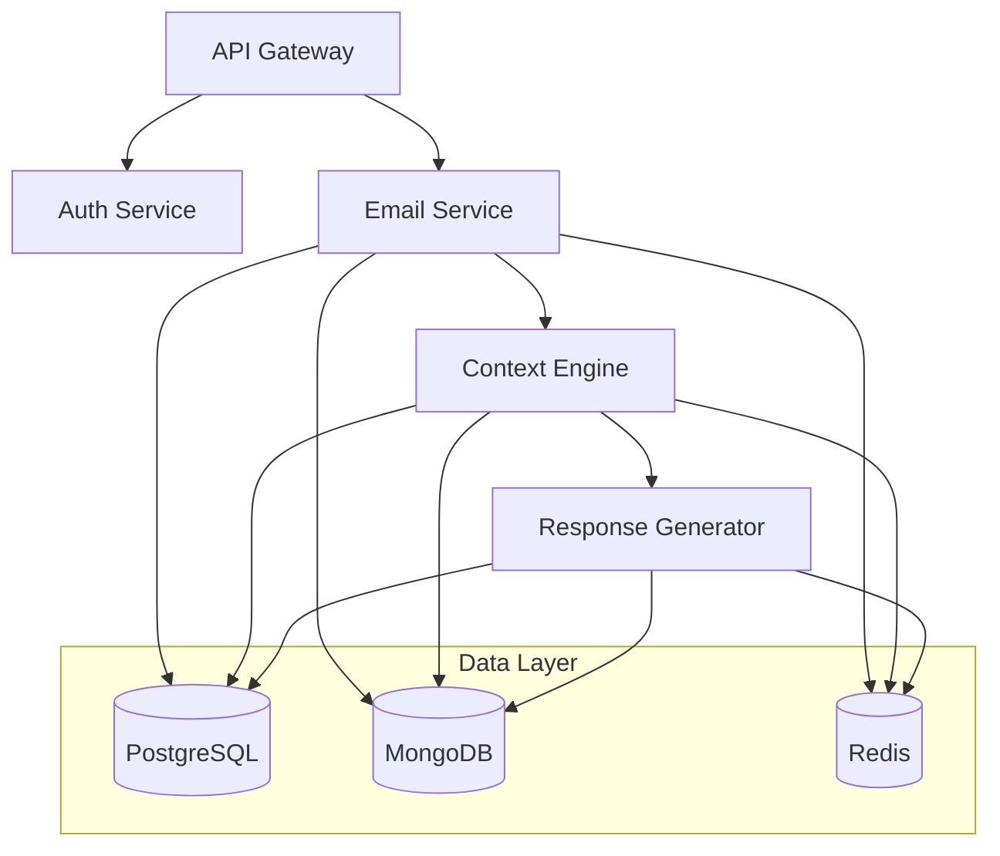

# AI Email Management Platform Backend
Version: 1.0.0 | Last Updated: 2023-12

## Table of Contents
- [Project Overview](#project-overview)
- [Getting Started](#getting-started)
- [Services](#services)
- [Development](#development)
- [Deployment](#deployment)
- [Troubleshooting](#troubleshooting)

## Project Overview

### Introduction
The AI Email Management Platform is an enterprise-grade middleware solution designed to revolutionize professional email communications through AI-powered automation. The backend system comprises multiple microservices that handle email processing, context analysis, and automated response generation.

### System Architecture


### Technology Stack
- **Languages**:
  - Go 1.21+ (Email Service)
  - Python 3.11+ (Context Engine, Response Generator)
  - TypeScript/Node.js 20.x LTS (API Gateway, Auth Service)

- **Frameworks**:
  - Gin (Go)
  - FastAPI (Python)
  - Express (Node.js)

- **Databases**:
  - PostgreSQL 14+
  - MongoDB 6.0+
  - Redis 7.0+

- **Infrastructure**:
  - Docker 24.0+
  - Kubernetes 1.28+
  - Istio 1.19+

### Key Features
- Real-time email monitoring and processing
- AI-powered context analysis
- Automated response generation
- Enterprise-grade security
- Scalable microservices architecture
- Comprehensive monitoring and logging

## Getting Started

### Prerequisites
```bash
# Required tools and versions
node >= 20.x LTS
go >= 1.21
python >= 3.11
docker >= 24.0
kubernetes >= 1.28
terraform >= 1.6
helm >= 3.12
kubectl >= 1.28
istioctl >= 1.19
```

### Environment Setup
1. Clone the repository:
```bash
git clone https://github.com/organization/email-platform-backend
cd email-platform-backend
```

2. Install dependencies:
```bash
# API Gateway & Auth Service
cd services/api-gateway && npm install
cd services/auth-service && npm install

# Email Service
cd services/email-service && go mod download

# Context Engine & Response Generator
cd services/context-engine && pip install -r requirements.txt
cd services/response-generator && pip install -r requirements.txt
```

3. Configure environment variables:
```bash
# Copy example environment files
cp .env.example .env

# Configure required variables for each service
# API Gateway
API_KEY=<your-api-key>
AUTH_SERVICE_URL=http://auth-service:3004
RATE_LIMIT_MAX=1000
CORS_ORIGINS=https://app.emailplatform.com

# Email Service
SMTP_CONFIG=<smtp-config-json>
IMAP_CONFIG=<imap-config-json>
CONTEXT_ENGINE_URL=http://context-engine:3002
DB_CONNECTION=postgresql://user:pass@db:5432/email_platform

# Context Engine
MODEL_PATH=/opt/models/context
RESPONSE_GEN_URL=http://response-generator:3003
MONGO_URI=mongodb://mongo:27017/context
REDIS_URL=redis://redis:6379/0

# Response Generator
MODEL_CONFIG=/opt/models/response
TEMPLATE_PATH=/opt/templates
MONGO_URI=mongodb://mongo:27017/responses
REDIS_URL=redis://redis:6379/1

# Auth Service
JWT_SECRET=<your-jwt-secret>
AUTH_PROVIDER_URL=<auth-provider-url>
DB_CONNECTION=postgresql://user:pass@db:5432/auth
REDIS_URL=redis://redis:6379/2
```

### Local Development
1. Start the development environment:
```bash
docker-compose up -d
```

2. Access services:
- API Gateway: http://localhost:3000
- Email Service: http://localhost:3001
- Context Engine: http://localhost:3002
- Response Generator: http://localhost:3003
- Auth Service: http://localhost:3004

## Services

### API Gateway (Port: 3000)
- Routes and authenticates all incoming requests
- Implements rate limiting and CORS
- Provides API documentation via Swagger
- Health check endpoint: `/health`
- Metrics endpoint: `/metrics`

### Email Service (Port: 3001)
- Handles email processing and routing
- Integrates with email providers via IMAP/SMTP
- Manages email metadata and storage
- Health check endpoint: `/health`
- Metrics endpoint: `/metrics`

### Context Engine (Port: 3002)
- Analyzes email content and maintains context
- Implements ML models for context understanding
- Provides context API for other services
- Health check endpoint: `/health`
- Metrics endpoint: `/metrics`

### Response Generator (Port: 3003)
- Generates automated email responses
- Manages response templates
- Implements ML models for response generation
- Health check endpoint: `/health`
- Metrics endpoint: `/metrics`

### Auth Service (Port: 3004)
- Handles authentication and authorization
- Manages user sessions and JWT tokens
- Integrates with external auth providers
- Health check endpoint: `/health`
- Metrics endpoint: `/metrics`

## Development

### Code Structure
```
src/backend/
├── services/
│   ├── api-gateway/
│   ├── email-service/
│   ├── context-engine/
│   ├── response-generator/
│   └── auth-service/
├── deploy/
│   ├── kubernetes/
│   ├── terraform/
│   └── helm/
├── scripts/
├── docs/
└── docker-compose.yml
```

### Development Workflow
1. Create feature branch from `develop`
2. Implement changes following service-specific guidelines
3. Write tests (unit, integration)
4. Submit PR for review
5. Merge to `develop` after approval
6. Deploy to staging for testing

### Testing
```bash
# Run unit tests
make test-unit

# Run integration tests
make test-integration

# Run e2e tests
make test-e2e

# Generate test coverage
make test-coverage
```

## Deployment

### Environment Strategy
- **Development**: Feature testing, minimal redundancy
- **Staging**: Pre-production testing, production-like setup
- **Production**: Live system, full redundancy
- **DR**: Hot standby in alternate region

### Infrastructure Setup
```bash
# Initialize Terraform
cd deploy/terraform
terraform init
terraform plan
terraform apply

# Deploy Kubernetes resources
cd deploy/kubernetes
kubectl apply -f namespace.yaml
kubectl apply -f secrets.yaml
kubectl apply -f configmaps.yaml

# Deploy services
helm upgrade --install email-platform ./deploy/helm/email-platform
```

### Monitoring Setup
- Prometheus for metrics collection
- Grafana for visualization
- ELK Stack for log aggregation
- Jaeger for distributed tracing

## Troubleshooting

### Common Issues
1. Service Connection Issues
   - Check service health endpoints
   - Verify network policies
   - Check service logs

2. Performance Issues
   - Monitor resource usage
   - Check scaling policies
   - Review database indexes

3. Authentication Issues
   - Verify JWT token configuration
   - Check auth provider connectivity
   - Review CORS settings

### Debug Procedures
1. Check service logs:
```bash
kubectl logs -f deployment/service-name
```

2. Access service shell:
```bash
kubectl exec -it deployment/service-name -- /bin/sh
```

3. Monitor metrics:
```bash
kubectl port-forward svc/prometheus 9090:9090
kubectl port-forward svc/grafana 3000:3000
```

### Support
- Technical Support: backend-support@emailplatform.com
- Repository: https://github.com/organization/email-platform-backend
- Documentation: [Internal Wiki]
- Issue Tracking: [JIRA Board]

## License
Proprietary - All rights reserved