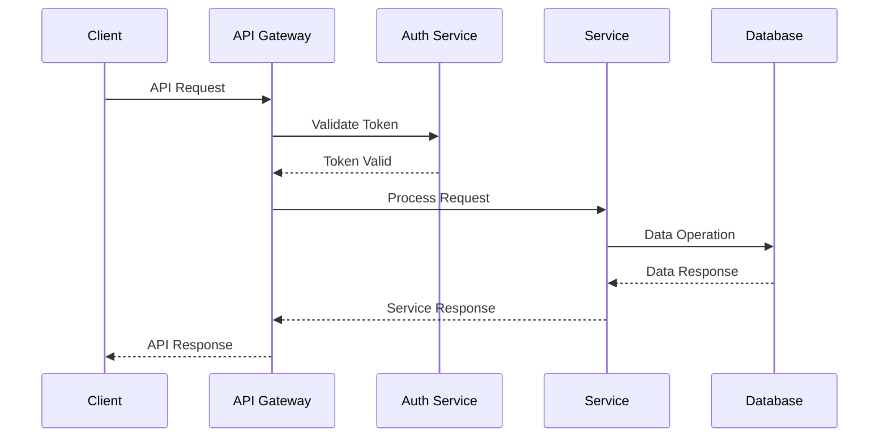

# AI-Powered Email Management Platform API Specification
Version: 1.0.0

## Table of Contents
- [Overview](#overview)
- [Authentication](#authentication)
- [Service Endpoints](#service-endpoints)
- [Data Models](#data-models)
- [Integration Patterns](#integration-patterns)
- [Performance Specifications](#performance-specifications)

## Overview

### Introduction
This document provides comprehensive API specifications for the AI-powered Email Management Platform. The platform exposes a set of gRPC and REST APIs that enable email processing, context analysis, and automated response generation.

### Base URLs
```yaml
Production: api.emailplatform.com
Staging: api-staging.emailplatform.com
Development: api-dev.emailplatform.com
```

### API Versioning
All APIs are versioned using the format: `v{major_version}`
Current version: v1

## Authentication

### OAuth 2.0 Authentication
```yaml
Type: OAuth 2.0 + JWT
Grant Types:
  - Authorization Code
  - Client Credentials
  - Refresh Token
Token Format: JWT (RS256)
Token Lifetime: 
  Access Token: 1 hour
  Refresh Token: 30 days
```

### Security Headers
```yaml
Required Headers:
  Authorization: Bearer {jwt_token}
  X-API-Key: {api_key}
  X-Request-ID: {unique_request_id}
```

## Service Endpoints

### Email Service
Base path: `/v1/email`

#### Get Email
```yaml
Method: GET
Path: /v1/email/{message_id}
Rate Limit: 100 requests/minute
Cache Policy: No cache
Request Parameters:
  message_id: string (required)
  account_id: string (required)
Response: EmailMessage
```

#### List Emails
```yaml
Method: GET
Path: /v1/email
Rate Limit: 100 requests/minute
Cache Policy: 5 minutes
Request Parameters:
  account_id: string (required)
  filter: EmailFilter
  page_size: int32
  page_token: string
Response: ListEmailsResponse
```

#### Send Email
```yaml
Method: POST
Path: /v1/email
Rate Limit: 50 requests/minute
Cache Policy: No cache
Request Body: SendEmailRequest
Response: EmailMessage
```

### Context Service
Base path: `/v1/context`

#### Analyze Context
```yaml
Method: POST
Path: /v1/context/analyze
Rate Limit: 50 requests/minute
Cache Policy: No cache
Request Body: AnalyzeContextRequest
Response: Context
```

#### Get Context
```yaml
Method: GET
Path: /v1/context/{context_id}
Rate Limit: 100 requests/minute
Cache Policy: 5 minutes
Request Parameters:
  context_id: string (required)
Response: Context
```

### Response Service
Base path: `/v1/response`

#### Generate Response
```yaml
Method: POST
Path: /v1/response/generate
Rate Limit: 50 requests/minute
Cache Policy: No cache
Request Body: GenerateResponseRequest
Response: Response
```

#### List Templates
```yaml
Method: GET
Path: /v1/response/templates
Rate Limit: 100 requests/minute
Cache Policy: 15 minutes
Request Parameters:
  category: TemplateCategory
  include_inactive: boolean
  page_size: int32
  page_token: string
Response: ListTemplatesResponse
```

## Data Models

### Email Models
```protobuf
// Key data models from email.proto
message EmailMessage {
  string message_id = 1;
  string thread_id = 2;
  string subject = 4;
  string content = 5;
  // ... additional fields
}

message EmailFilter {
  string from_address = 1;
  DateRange date_range = 2;
  // ... additional fields
}
```

### Context Models
```protobuf
// Key data models from context.proto
message Context {
  string context_id = 1;
  string email_id = 2;
  repeated ProjectContext project_contexts = 4;
  // ... additional fields
}
```

### Response Models
```protobuf
// Key data models from response.proto
message Response {
  string response_id = 1;
  string content = 4;
  ResponseTone tone = 6;
  ResponseStatus status = 7;
  // ... additional fields
}
```

## Integration Patterns

### Service Communication Flow


### Error Handling
```yaml
Error Response Format:
  status: HTTP status code
  error: Error identifier
  message: Human-readable message
  details: Additional error context
  request_id: Original request ID
```

### Rate Limiting
```yaml
Default Limits:
  - Read Operations: 100 requests/minute
  - Write Operations: 50 requests/minute
  - Analysis Operations: 50 requests/minute
Headers:
  X-RateLimit-Limit: Maximum requests allowed
  X-RateLimit-Remaining: Requests remaining
  X-RateLimit-Reset: Time until limit reset
```

## Performance Specifications

### Latency Targets
```yaml
API Response Times:
  - Read Operations: < 100ms (p95)
  - Write Operations: < 200ms (p95)
  - Analysis Operations: < 500ms (p95)
  - Batch Operations: < 1000ms (p95)
```

### Throughput
```yaml
Capacity:
  - Read Operations: 1000 RPS
  - Write Operations: 500 RPS
  - Analysis Operations: 200 RPS
  - Concurrent Connections: 10,000
```

### Availability
```yaml
SLA Targets:
  - API Availability: 99.9%
  - Error Rate: < 0.1%
  - Scheduled Maintenance: Monthly 2-hour window
```

### Monitoring
```yaml
Metrics:
  - Request Rate
  - Error Rate
  - Response Time
  - CPU Usage
  - Memory Usage
  - Active Connections
Headers:
  X-Response-Time: Processing time in ms
  X-Request-ID: Request tracking ID
```