# AI Email Management Platform Architecture Documentation

Version: 2.0.0
Last Updated: 2023-12

## Table of Contents
1. [System Overview](#1-system-overview)
2. [Architecture Principles](#2-architecture-principles)
3. [Core Components](#3-core-components)
4. [Data Architecture](#4-data-architecture)
5. [Integration Patterns](#5-integration-patterns)
6. [Security Architecture](#6-security-architecture)
7. [Deployment Architecture](#7-deployment-architecture)
8. [Monitoring & Observability](#8-monitoring--observability)

## 1. System Overview

The AI Email Management Platform is a sophisticated middleware solution designed to revolutionize professional email communications through AI-powered automation and context awareness. The system implements a microservices architecture with the following key components:

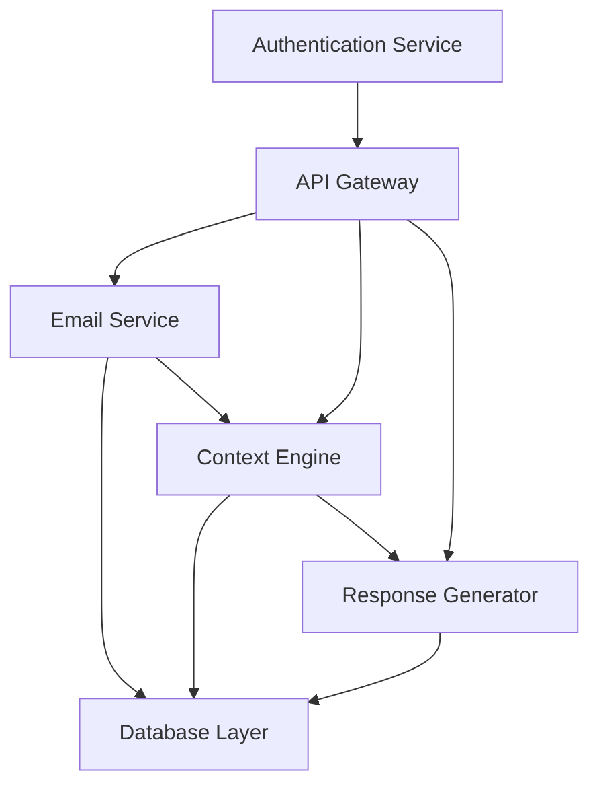

### 1.1 Key Components

- **Email Service**: Go-based service handling email processing and routing
- **Context Engine**: Python-based service for context analysis and maintenance
- **Response Generator**: Python-based service for automated response generation
- **API Gateway**: Kong-based gateway for routing and authentication
- **Database Layer**: Multi-database architecture with PostgreSQL, MongoDB, and Redis

## 2. Architecture Principles

### 2.1 Design Principles

1. **Microservices Architecture**
   - Loosely coupled services
   - Independent deployment and scaling
   - Service-specific data ownership

2. **Event-Driven Communication**
   - Asynchronous message processing
   - RabbitMQ for message queuing
   - Event sourcing for state management

3. **Security-First Design**
   - End-to-end encryption
   - Zero-trust architecture
   - Role-based access control

4. **Scalability**
   - Horizontal scaling capabilities
   - Auto-scaling based on load
   - Distributed caching with Redis

## 3. Core Components

### 3.1 Email Service (Go)

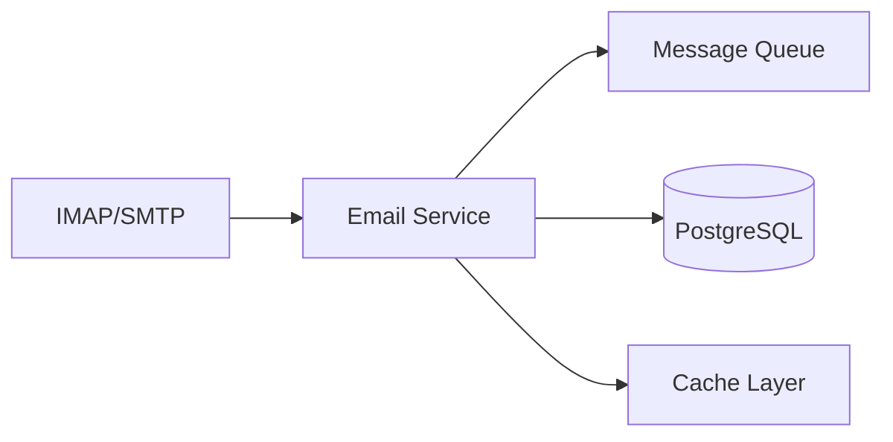

- **Purpose**: Email processing and routing
- **Technology**: Go 1.21+
- **Key Features**:
  - IMAP/SMTP integration
  - Real-time email monitoring
  - Thread tracking
  - Message queuing

### 3.2 Context Engine (Python)

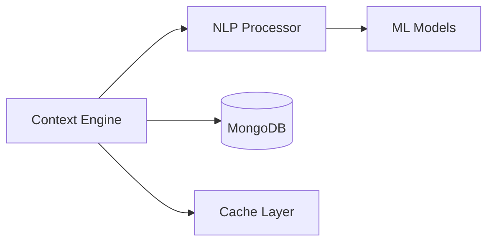

- **Purpose**: Context analysis and maintenance
- **Technology**: Python 3.11+
- **Key Features**:
  - NLP processing
  - Context extraction
  - Machine learning integration
  - Real-time analysis

### 3.3 Response Generator (Python)

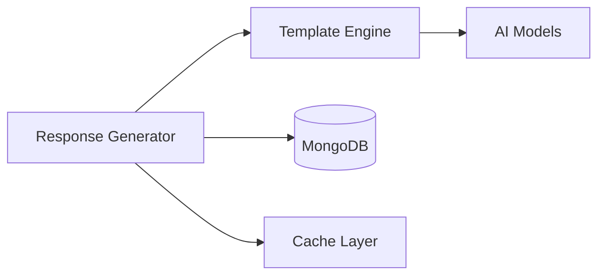

- **Purpose**: Automated response generation
- **Technology**: Python 3.11+
- **Key Features**:
  - AI-powered generation
  - Template management
  - Tone control
  - Learning system

## 4. Data Architecture

### 4.1 Database Design

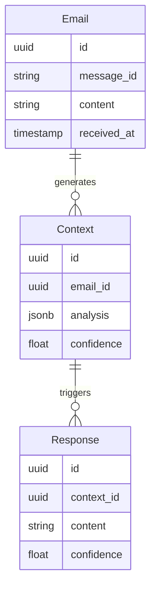

### 4.2 Data Flow

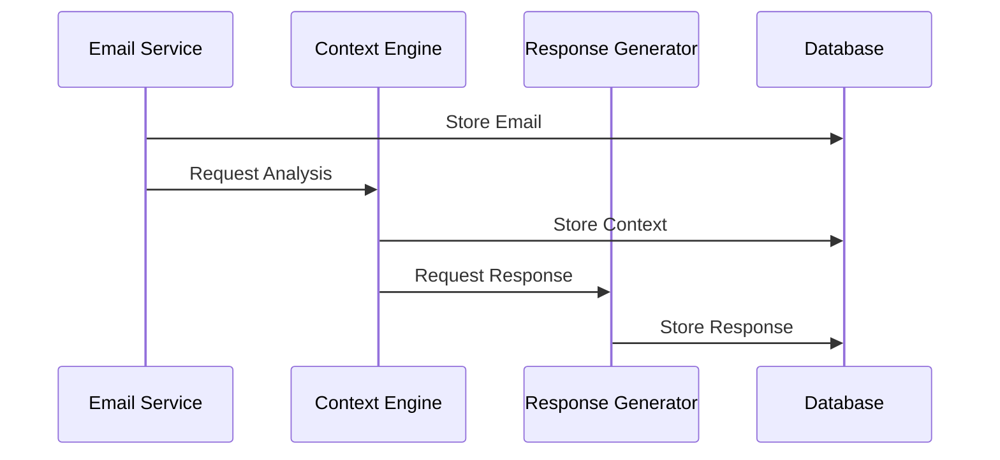

## 5. Integration Patterns

### 5.1 Service Communication

- **Synchronous**: REST APIs for direct requests
- **Asynchronous**: RabbitMQ for event-driven communication
- **Service Mesh**: Istio for service-to-service communication

### 5.2 API Design

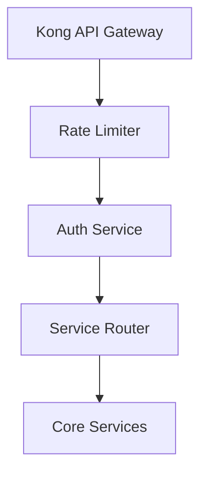

## 6. Security Architecture

### 6.1 Authentication & Authorization

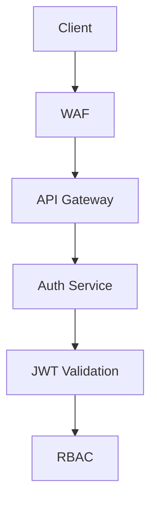

### 6.2 Data Security

- End-to-end encryption
- At-rest encryption
- Key rotation
- Audit logging

## 7. Deployment Architecture

### 7.1 Kubernetes Architecture

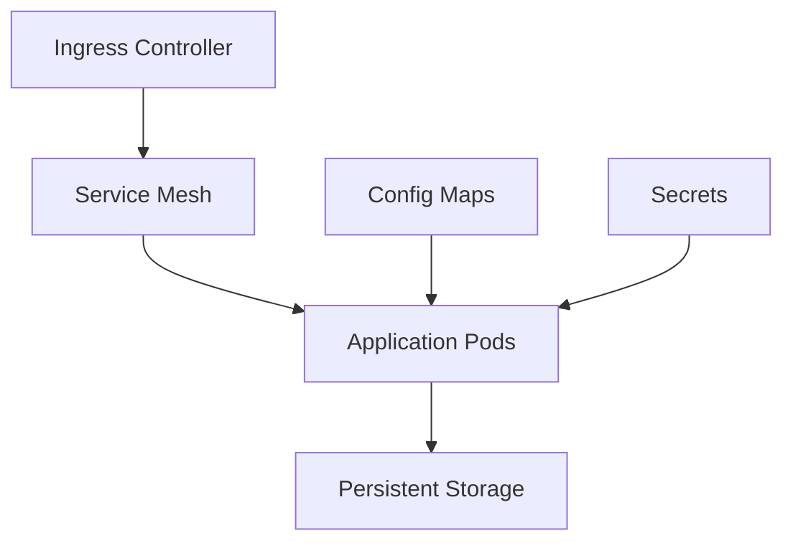

### 7.2 CI/CD Pipeline

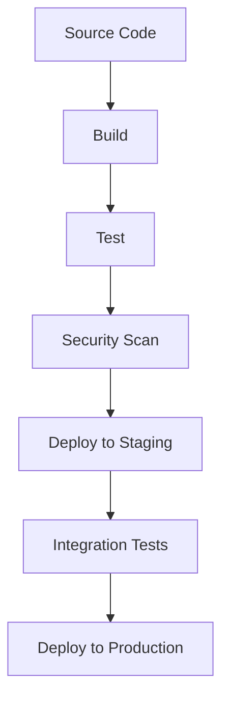

## 8. Monitoring & Observability

### 8.1 Monitoring Stack

- **Metrics**: Prometheus + Grafana
- **Logging**: ELK Stack
- **Tracing**: Jaeger
- **Alerting**: AlertManager

### 8.2 Health Checks

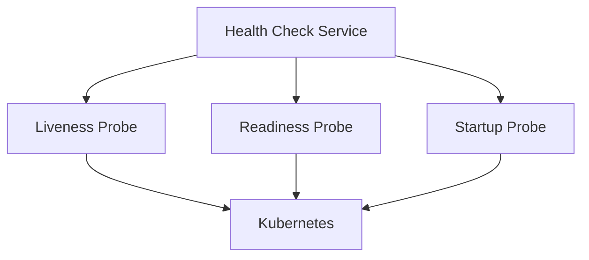

### 8.3 Metrics Collection

- Request latency
- Error rates
- Resource utilization
- Business metrics